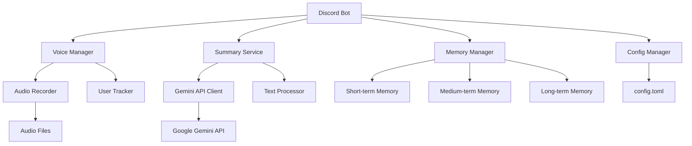

# 設計書

## 概要

Discord音声要約botは、Node.jsとTypeScriptで構築され、discord.jsライブラリを使用してDiscord APIと連携します。Google Gemini APIを使用して音声の文字起こしと要約を行い、複数レベルのメモリーシステムで文脈を管理します。

## アーキテクチャ

### システム構成



### 主要コンポーネント

1. **Discord Bot Core**: メインのbot制御とイベント処理
2. **Voice Manager**: ボイスチャンネルの参加/退出とユーザー監視
3. **Audio Recorder**: ユーザーごとの音声録音とセグメント管理
4. **Summary Service**: Gemini APIを使用した要約生成
5. **Memory Manager**: 短期・中期・長期メモリーの管理
6. **Config Manager**: config.tomlファイルの読み込みと管理

## コンポーネントと インターフェース

### Config Manager

```typescript
interface BotConfig {
  discord: {
    token: string;
    guildId: string;
  };
  gemini: {
    apiKey: string;
    model: string;
  };
  voice: {
    minUsersToJoin: number;
    allowedCategories: string[];
    deniedChannels: string[];
    summaryInterval: number; // 分
  };
  channels: {
    summaryChannelId: string;
  };
}
```

### Voice Manager

```typescript
interface VoiceManager {
  checkAutoJoin(channelId: string): Promise<boolean>;
  joinChannel(channelId: string): Promise<void>;
  leaveChannel(): Promise<void>;
  getUnmutedUsers(channelId: string): User[];
  onUserJoin(user: User, channel: VoiceChannel): void;
  onUserLeave(user: User, channel: VoiceChannel): void;
}
```

### Audio Recorder

```typescript
interface AudioRecorder {
  startRecording(userId: string): void;
  stopRecording(userId: string): AudioSegment[];
  detectSilence(userId: string): boolean;
  getSegments(userId: string): AudioSegment[];
}

interface AudioSegment {
  userId: string;
  startTime: Date;
  endTime: Date;
  audioBuffer: Buffer;
  transcription?: string;
}
```

### Memory Manager

```typescript
interface MemoryManager {
  addToShortTerm(content: string, timestamp: Date): void;
  addToMediumTerm(summary: string, timestamp: Date): void;
  addToLongTerm(context: string, timestamp: Date): void;
  getShortTermContext(): string;
  getMediumTermContext(): string;
  getLongTermContext(): string;
  getCurrentActivity(): string;
}

interface MemoryEntry {
  content: string;
  timestamp: Date;
  type: 'conversation' | 'summary' | 'context';
}
```

### Summary Service

```typescript
interface SummaryService {
  transcribeAudio(audioSegments: AudioSegment[]): Promise<string>;
  generateShortSummary(transcription: string, context: string): Promise<string>;
  generateMediumSummary(shortSummaries: string[], context: string): Promise<string>;
  generateWelcomeMessage(currentActivity: string, recentSummary: string): Promise<string>;
  updateCurrentActivity(transcription: string, previousActivity: string): Promise<string>;
}
```

## データモデル

### 設定ファイル (config.toml)

```toml
[discord]
token = "YOUR_DISCORD_BOT_TOKEN"
guild_id = "YOUR_GUILD_ID"

[gemini]
api_key = "YOUR_GEMINI_API_KEY"
model = "gemini-1.5-flash"

[voice]
min_users_to_join = 3
allowed_categories = ["General Voice", "Gaming"]
denied_channels = ["AFK Channel", "Private Room"]
summary_interval = 1  # 分

[channels]
summary_channel_id = "YOUR_SUMMARY_CHANNEL_ID"
```

### メモリーストレージ

```typescript
interface ShortTermMemory {
  conversations: MemoryEntry[];  // 直近5分間の会話
  maxAge: number; // 5分
}

interface MediumTermMemory {
  summaries: MemoryEntry[];  // 直近1時間の要約
  maxAge: number; // 1時間
}

interface LongTermMemory {
  activities: MemoryEntry[];  // 過去の活動履歴
  maxEntries: number; // 100エントリー
}
```

## エラーハンドリング

### エラータイプ

1. **Discord API エラー**: 接続失敗、権限不足
2. **Gemini API エラー**: API制限、認証失敗
3. **音声録音エラー**: 音声取得失敗、ファイル保存エラー
4. **設定エラー**: config.toml読み込み失敗、不正な設定値

### エラー処理戦略

```typescript
interface ErrorHandler {
  handleDiscordError(error: DiscordAPIError): void;
  handleGeminiError(error: GeminiAPIError): void;
  handleAudioError(error: AudioError): void;
  handleConfigError(error: ConfigError): void;
  logError(error: Error, context: string): void;
}
```

### リトライ機構

- Gemini API呼び出し: 指数バックオフで最大3回リトライ
- Discord API呼び出し: レート制限を考慮したリトライ
- 音声録音: 一時的な失敗時の自動復旧

## テスト戦略

### 単体テスト

1. **Config Manager**: 設定ファイル読み込みテスト
2. **Audio Recorder**: 音声セグメント分割テスト
3. **Memory Manager**: メモリー管理ロジックテスト
4. **Summary Service**: モックAPIを使用した要約生成テスト

### 統合テスト

1. **Voice Manager + Audio Recorder**: ボイスチャンネル参加と録音の連携
2. **Summary Service + Memory Manager**: 要約生成とメモリー更新の連携
3. **Discord Bot + 全コンポーネント**: エンドツーエンドの動作確認

### テストデータ

```typescript
interface TestData {
  mockAudioSegments: AudioSegment[];
  mockDiscordEvents: DiscordEvent[];
  mockGeminiResponses: GeminiResponse[];
  testConfig: BotConfig;
}
```

### モック戦略

- Discord.js: モックギルド、チャンネル、ユーザーオブジェクト
- Gemini API: 予定された応答を返すモッククライアント
- 音声データ: テスト用の短い音声ファイル

## パフォーマンス考慮事項

### メモリー管理

- 短期メモリー: 5分間のローリングウィンドウ
- 中期メモリー: 1時間のローリングウィンドウ
- 長期メモリー: 最大100エントリーのLRUキャッシュ

### API使用量最適化

- 音声セグメントのバッチ処理
- 無音期間の自動検出による不要な処理の削減
- Gemini APIレスポンスのキャッシュ（同一内容の重複要求回避）

### 音声処理最適化

- ユーザーごとの並列録音処理
- 無音検出による自動セグメント分割
- 音声ファイルの一時保存と自動削除